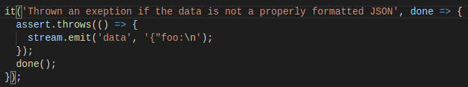

### Ejercicios

**Testability exercises**

1. Add a unit test for a single message that is split over two or more data evetns from the stream:
    - El primer test ha sido ya implementado durante los ejemplos del capítulo:

    

2. Add a unit test that passes in null to the LDJClient constructor, and asserts that an error is thrown. Then make the test pass by modifying the constructor to accept null: the semantic being that the created stream behaves as /dev/null in Unix.

    

Comprobamos el correcto funcionamiento:

**Robustness exercises**

1. The LDJClient already handles the case in which a properly formatted JSON string is split over multiply lines. What happen if the incoming data is not a properly formatted JSON string?

    - Lanzará una excepción:

    

2. What happens if the last data event completes a a JSON message, but without the trailing new line?
 
El funcionamiento sería correcto, no añadería el salto de línea, pero no fallaría.