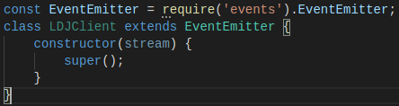
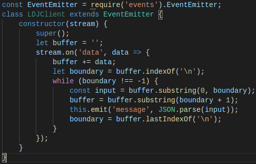
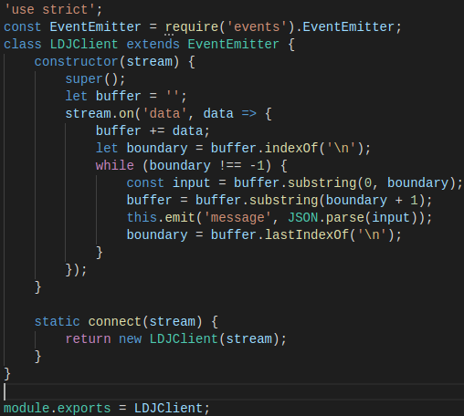
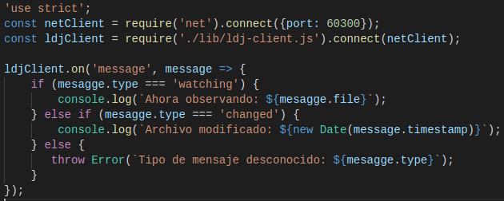
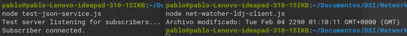

### Extending Core Classes in Custom Modules

En el apartado anterior un fallo en nuestro programa cliente: no almacena sus entradas en el búfer. Cualquier mensaje que llegue como múltiples eventos de datos lo bloqueará. 

Así será necesario que el programa cliente almacene los datos entrantes en los mensajes y maneje cada mensaje cuando llegue. Para ello crearemos un módulo que maneje el buffer de entrada para que el programa principal pueda obtener mensajes completos de manera confiable.  

**Extending EventEmitter**

Implementamos un módulo para el programa cliente de almacenamiento en búfer LDJ. 

1. **Inheritance in Node**:

Veamos como funciona la herencia en Node.js; El siguiente código configura DHClient para heredar de EventEmitter:

- *LDJClient* es una clase, lo que implica que se debe llamar a *new LDJClient(stream)* para obtener una instancia. El parametro *stream* es un objeto que envía enventos de datos.

- Dentro del constructor se llama a *super* para invocar al constructor de *EventEmitter*.

- El código para usar *LDJClient* podría ser el siguiente:
<pre><code> const client = new LDJClient(networkStream);
client.on('meagge',mesagge => {
    // Tomar acciones para el mensaje
}) </code></pre>

Una vez establecida la jerarquía de clases debemos implimentar el envío de eventos de mensaje.

2. **Buffering Data Events**: El objetivo es utilizar el parámetro *stream* para recuper y almacenar en el buffer la entrada. El objetivo es tomar los datos entrantes sin procesar y convertirlos en eventos de mensaje que contengan los objetos de mensaje completo:

- El código agrega fragmentos del mensaje a una cadena buffer y busca terminaciones de línea (que corresponderían con los límites de mensajes JSON).

- Comenzamos llamando a *super* y configuramos una variable string llamada *buffer* que capture los datos entrantes.

- Luego utilizamos *steam.on* para controlar los eventos de datos; primero se agregan los datos sin procesar al final del buffer y luego se buscan los mensajes completos desde el frente.

- Cada cadena del mensaje se envía a través de *JSON.parse* para que finalmente sea emitido por *LDJClient* como un evento de mensaje via *this.emit*.

Con esto quedaría resuleto el manejo de mensajes.

3. **Exporting Functionality in a Module**: Ahora añadiremos la clase implementada dentro de un módulo.

- En primer lugar ya tenemos creado el directorio *lib*, donde por convención se almacenan los modulos.

- El contenido del módulo es el siguiente:

Trás el código desarrollado previamente, añadimos un método estático llamado *connect*, este método estático se adjunta a la clase LDJClient en lugar de aplicarse a instancias individuales. 

En un módulo Node.js, el objeto *module.exports* funciona como puente entre el código del módulo y el resto de elementos. El código para usar el módulo LDJ se verá así:

<pre><code> const​ LDJClient = require(​'./lib/ldj-client.js'​);​ 
​const​ client = ​new​ LDJClient(networkStream);</pre></code>

Si se usa el método *connect*:

<pre><code> ​const​ client = require(​'./lib/ldj-client.js'​).connect(networkStream); </code></pre>

En ambos casos es necesario especificar la ruta completa.

**Importing a Custom Node.js Module**

Para utilizar el módulo implementado definimos el programa cliente:

Comprobamos que se soluciona el problema de los mensajes fragmentados:

