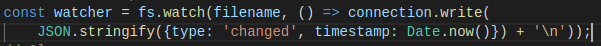

### Implementing a Messaging Protocol

Un **protocolo** se puede entender como un conjunto de reglas que define como se comunican los puntos finales en un sistema. En este apartado crearemos un protocolo basado en pasar mensajes *JSON* a través de TCP.

**Serializing messages with JSON**

Cada mensaje es un objeto JSON que es un hash de pares clave-valor, por ejemplo:

<pre><code>{ "Key" : "value", "anotherKey" : "anotherValue" }</code></pre>

El programa *net-watcher* desarrollado en el apartado anterior envía dos tipos de mensaje que tenemos que convertir a JSON:
1. Cuando la conección se establece, el cliente recibe el mensaje "No watching *target.txt* for changes..."
2. Cuando se producen cambios en el fichero, el cliente recibe otro mensaje donde se muestra la notificación y la fecha del cambio.

No hay saltos de línea en nuestros mensajes JSON, nuestro protocolo usará nuevas líneas solo para separar los mensajes. Este protocolo se conoce como *line-delimited JSON* (LDJ). 

Codificaremos el primer mensaje de esta forma, donde *type* indica el tipo de mensaje, y *file* hace referencia al fichero que se está controlando: 

En el segundo mensaje, *type* anunciará que el archivo ha sufrido cambios, y el campo *timestamp* contiene un valor entero que representa el número de milisegundos desde la medianoche del 1 de enero de 1970. Modificamos este mensaje:

Ejecutamos el programa y observamos los cambios:

