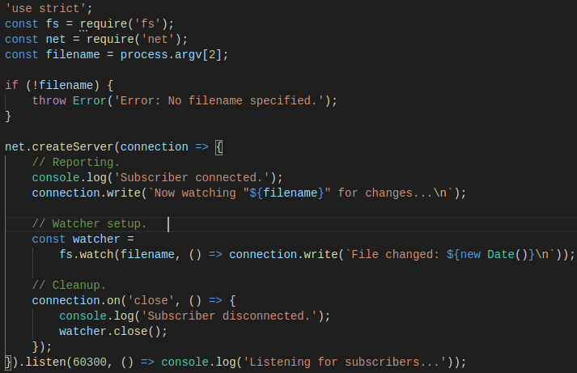
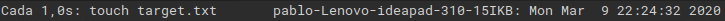
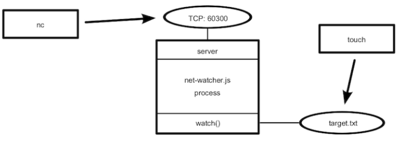

### Listening for Socket Connections

 Los servicios de red tienen dos funciones principales: Connectar puntos finales (endpoints) y transmitir información entre ellos. En este apartado veremos como crear servicios basados en sockets utilizando *Node*.

**Binding a Server to a TCP Port**

Las conexiones de socket TCP constan de dos puntos finales; uno se une a un puerto numerado mientras que el otro se conecta a un puerto. En *Node.js* las operaciones de enlace y conexión son proporcionadas por el módulo de red (net module). La forma de enlazar un puerto TCP para escuchar conexiones es la siguiente:

Donde:

- El método **net.createServer** toma una función *callback* y devuelve un objeto *Servidor*. *Node.js* invocará la *callback* cada cada vez que se conecte otro punto final (endpoint).
- El parámetro de conexión será un objeto *Socket* que se puede usar para enviar o recibir datos.
- Llamar a **server.listen** vincula el puerto especificado.

La siguiente figura nos muestra un ejemplo del funcionamiento, donde existe un proceso *Node.js* enlazado a un puerto TCP y donde cualquier número de clientes pueden conectarse al puerto enlazado.

**Writing Data to a Socket**

Como fuente de información para el servicio de red que crearemos a continuación, utilizaremos los cambios producidos en un archivo a partir de las utilidades desarrolladas en prácticas anteriores. 

Primero crearemos un directorio *networking* para almacenar el código que vamos a escribir. Después creamos el siguiente archivo:

En el archivo se observa que:

- En la parte superior se extraen los módulos *fs* y *net*.
- El nombre del archivo se procesa como un argumento en la línea de comandos. En caso de que no se haya especificado un nombre de archivo, se lanza un error.
-  La función *callback createServer* hace tres cosas:
    1. Informa que se ha establecido la conexión (tanto para el cliente con *connection.write* como para la consola).
    2. Empieza a escuchar por cambios en el fichero objetivo, guardando el objeto *watcher* devuelto. Esta *callback* envia información con los cambios al cliente mediante *connection.write*.
    3. Vigila el evento de conexión *close* para dejar de controlar los cambios en el fichero con *watcher.close*.

Por último la *callback* se transmite a *serven.listen* al final. *Node.js* invoca esta función después de que haya enlazado el puerto 60300 con éxito y esté listo para recibir conexiones.

**Connecting to a TCP Socket Server with Netcat**

A continuación comprobamos la ejecución del programa *net-watcher*. Trabajamos con tres terminales distintas:

- En la primera terminal utilizaremos el comando *watch* para realizar un *touch* sobre el fichero *target.txt* en intervalos de 1 segundo:

<code>watch -n 1 touch target.txt</code>

- En la segunda terminal ejecutamos el programa con el fichero, creando un servicio que escucha en el puerto 60300:

- Para conectar con el servicio hacemos uso de *netcat*:

- En la terminal que corre el servicio podremos apreciar que un usuario se ha conectado:

Veamos la configuración creada en el siguiente diagrama, donde el proceso de *net-watcher* enlaza un puerto TCP y observa un archivo. En este caso es posible que varios usuarios se conecten y reciban actualizaciones simultaneas:

*Listening to Unix Sockets*

Los *sockets* de Unix son una alternativa más eficiente si se quiere comunicar procesos en un mismo equipo. Pueden ser más rápidos que los sockets TCP porque no requieren invocar hardware de red.
Para ver cómo el módulo *net* usa este tipo de sockets, modificamos el programa cambiando el *.listen* de la siguiente forma:

Volvemos a ejecutar el programa y para connectar el cliente utilizaremos de nuevo *nc* pero con la opción -U para usar el archivo socket.

