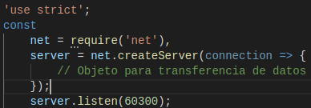

## p4-t2-networking-alu0100658705
## Pablo Bethencourt Díaz
## alu0100658705@ull.edu.es

## Networking with Sockets

En este capítulo trabajaremos con el soporte incorporado de **Node.js** para conexiones de socket de bajo nivel. Los sockets TCP forman el *backbone* de las aplicaciones de red actuales.

Los contenidos que se trabajan en este capítulo son los siguientes:

1. **Node.js Core**: Creación de módulos personalizados para alojar código reutilizable.

2. **Patterns** : Partiendo que una conexión de red tiene dos puntos finales (endpoints), un patrón común es que un punto final actúe como servidor mientras el otro lo hace como cliente. Se trabajarán con ambos puntos finales.

3. **JavaScriptism** : Utilidades de *Node.js* para crear jerarquías de clases.

4. **Supporting Code** : Trabajar con el framework *Mocha* para realizar pruebas unitarias.

Para comenzar, se desarrollará un servidor TCP simple y otro más completo. Luego se irán mejorando a medida que se trabajen aspectos como la robuztes, la modularidad y la testeabilidad.

### Listening for Socket Connections

 Los servicios de red tienen dos funciones principales: Connectar puntos finales (endpoints) y transmitir información entre ellos. En este apartado veremos como crear servicios basados en sockets utilizando *Node*.

**Binding a Server to a TCP Port**

Las conexiones de socket TCP constan de dos puntos finales; uno se une a un puerto numerado mientras que el otro se conecta a un puerto. En *Node.js* las operaciones de enlace y conexión son proporcionadas por el módulo de red (net module). La forma de enlazar un puerto TCP para escuchar conexiones es la siguiente:

Donde:
    - El método **net.createServer** toma una función *callback* y devuelve un objeto *Servidor*. *Node.js* invocará la *callback* cada cada vez que se conecte otro punto final (endpoint).
    - El parámetro de conexión será un objeto *Socket* que se puede usar para enviar o recibir datos.
    - Llamar a **server.listen** vincula el puerto especificado.

    