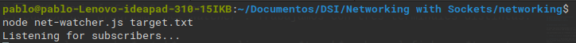
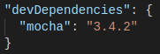
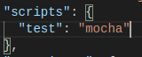
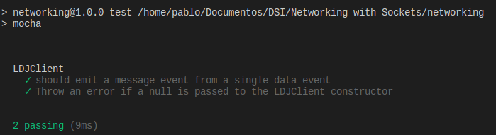

## p4-t2-networking-alu0100658705
## Pablo Bethencourt Díaz
## alu0100658705@ull.edu.es

## Networking with Sockets

En este capítulo trabajaremos con el soporte incorporado de **Node.js** para conexiones de socket de bajo nivel. Los sockets TCP forman el *backbone* de las aplicaciones de red actuales.

Los contenidos que se trabajan en este capítulo son los siguientes:

1. **Node.js Core**: Creación de módulos personalizados para alojar código reutilizable.

2. **Patterns** : Partiendo que una conexión de red tiene dos puntos finales (endpoints), un patrón común es que un punto final actúe como servidor mientras el otro lo hace como cliente. Se trabajarán con ambos puntos finales.

3. **JavaScriptism** : Utilidades de *Node.js* para crear jerarquías de clases.

4. **Supporting Code** : Trabajar con el framework *Mocha* para realizar pruebas unitarias.

Para comenzar, se desarrollará un servidor TCP simple y otro más completo. Luego se irán mejorando a medida que se trabajen aspectos como la robuztes, la modularidad y la testeabilidad.

### Listening for Socket Connections

 Los servicios de red tienen dos funciones principales: Connectar puntos finales (endpoints) y transmitir información entre ellos. En este apartado veremos como crear servicios basados en sockets utilizando *Node*.

**Binding a Server to a TCP Port**

Las conexiones de socket TCP constan de dos puntos finales; uno se une a un puerto numerado mientras que el otro se conecta a un puerto. En *Node.js* las operaciones de enlace y conexión son proporcionadas por el módulo de red (net module). La forma de enlazar un puerto TCP para escuchar conexiones es la siguiente:

Donde:

- El método **net.createServer** toma una función *callback* y devuelve un objeto *Servidor*. *Node.js* invocará la *callback* cada cada vez que se conecte otro punto final (endpoint).
- El parámetro de conexión será un objeto *Socket* que se puede usar para enviar o recibir datos.
- Llamar a **server.listen** vincula el puerto especificado.

La siguiente figura nos muestra un ejemplo del funcionamiento, donde existe un proceso *Node.js* enlazado a un puerto TCP y donde cualquier número de clientes pueden conectarse al puerto enlazado.

**Writing Data to a Socket**

Como fuente de información para el servicio de red que crearemos a continuación, utilizaremos los cambios producidos en un archivo a partir de las utilidades desarrolladas en prácticas anteriores. 

Primero crearemos un directorio *networking* para almacenar el código que vamos a escribir. Después creamos el siguiente archivo:

En el archivo se observa que:

- En la parte superior se extraen los módulos *fs* y *net*.
- El nombre del archivo se procesa como un argumento en la línea de comandos. En caso de que no se haya especificado un nombre de archivo, se lanza un error.
-  La función *callback createServer* hace tres cosas:
    1. Informa que se ha establecido la conexión (tanto para el cliente con *connection.write* como para la consola).
    2. Empieza a escuchar por cambios en el fichero objetivo, guardando el objeto *watcher* devuelto. Esta *callback* envia información con los cambios al cliente mediante *connection.write*.
    3. Vigila el evento de conexión *close* para dejar de controlar los cambios en el fichero con *watcher.close*.

Por último la *callback* se transmite a *serven.listen* al final. *Node.js* invoca esta función después de que haya enlazado el puerto 60300 con éxito y esté listo para recibir conexiones.

**Connecting to a TCP Socket Server with Netcat**

A continuación comprobamos la ejecución del programa *net-watcher*. Trabajamos con tres terminales distintas:

- En la primera terminal utilizaremos el comando *watch* para realizar un *touch* sobre el fichero *target.txt* en intervalos de 1 segundo:

<code>watch -n 1 touch target.txt</code>

- En la segunda terminal ejecutamos el programa con el fichero, creando un servicio que escucha en el puerto 60300:

- Para conectar con el servicio hacemos uso de *netcat*:

- En la terminal que corre el servicio podremos apreciar que un usuario se ha conectado:

Veamos la configuración creada en el siguiente diagrama, donde el proceso de *net-watcher* enlaza un puerto TCP y observa un archivo. En este caso es posible que varios usuarios se conecten y reciban actualizaciones simultaneas:

*Listening to Unix Sockets*

Los *sockets* de Unix son una alternativa más eficiente si se quiere comunicar procesos en un mismo equipo. Pueden ser más rápidos que los sockets TCP porque no requieren invocar hardware de red.
Para ver cómo el módulo *net* usa este tipo de sockets, modificamos el programa cambiando el *.listen* de la siguiente forma:

Volvemos a ejecutar el programa y para connectar el cliente utilizaremos de nuevo *nc* pero con la opción -U para usar el archivo socket.

### Implementing a Messaging Protocol

Un **protocolo** se puede entender como un conjunto de reglas que define como se comunican los puntos finales en un sistema. En este apartado crearemos un protocolo basado en pasar mensajes *JSON* a través de TCP.

**Serializing messages with JSON**

Cada mensaje es un objeto JSON que es un hash de pares clave-valor, por ejemplo:

<pre><code>{ "Key" : "value", "anotherKey" : "anotherValue" }</code></pre>

El programa *net-watcher* desarrollado en el apartado anterior envía dos tipos de mensaje que tenemos que convertir a JSON:
1. Cuando la conección se establece, el cliente recibe el mensaje "No watching *target.txt* for changes..."
2. Cuando se producen cambios en el fichero, el cliente recibe otro mensaje donde se muestra la notificación y la fecha del cambio.

No hay saltos de línea en nuestros mensajes JSON, nuestro protocolo usará nuevas líneas solo para separar los mensajes. Este protocolo se conoce como *line-delimited JSON* (LDJ). 

Codificaremos el primer mensaje de esta forma, donde *type* indica el tipo de mensaje, y *file* hace referencia al fichero que se está controlando: 

En el segundo mensaje, *type* anunciará que el archivo ha sufrido cambios, y el campo *timestamp* contiene un valor entero que representa el número de milisegundos desde la medianoche del 1 de enero de 1970. Modificamos este mensaje:

Ejecutamos el programa y observamos los cambios:

### Creating Socket Client Connections

A continuación definimos un programa cliente en *Node.js* para recibir mensajes JSON en nuestro programa *net-watcher-json-service*. Veamos la implementación:

- *net.connect* se usa para crear una conexión cliente local al puerto 60300.
- El objeto cliente es un Socket, igual que es el caso del servidor.
- Cada vez que ocurre un evento de datos, la función *callback* toma el objeto buffer entrante, analiza el mensaje JSON y luego registra en la consola el mensaje apropiado.
- El programa escucha unicamente eventos de datos.

Vemos su ejecución:

### Testing Network Application Functionally

Los *Functional test* o pruebas funcionales nos aseguran que nuestro código se comporta de la manera que esperamos. En este apartado desarrollamos pruebas para el programa *file-watching* tanto para el servidor como para el cliente.

**Understanding the Mesagge-Boundary Problem**

Muchas veces los progrmas en red de Node.js se comunican pasando mensajes, siendo posible que estos mensajes no lleguen de una vez, sino que lleguen en pedazos, divididos en eventos de datos distintos.

El protocolo LDJ separa los mensajes con caracteres de nueva linea, estos caracteres suponen el límite entre dos mensajes.

En el servico que hemos desarrollado, cada vez que se produce un cambio, codifica y envía el mensaje a la conexión, incluyendo la nueva línea. Los límites del evento de datos corresponden con los límites del mensaje, pero podría darse el caso de que un mensaje se dividiera por la mitad y llegase como dos eventos de datos separados:

A continuación crearemos un servicio de prueba que envíe un mensaje dividido para comprobar como respondería el cliente.

**Implementing a Test Service**

Implementamos un servicio de prueba que divide un mensaje en múltiples fragmentos:

Primero se envia la primera parte del mensaje, y después de un pequeño margen de tiempo, se envía la segunda.
Siempre que la conexión finaliza, se usa *clearTimeout* para cancelar la programación de la devolución de llamada, que es necesario porque una vez que se cierra una conexión, cualquier llamada a *connection.write* activará eventos de error.

Nos conectamos con el programa cliente para ver que sucede:

El error *Unexpected token* nos dice que el mensaje no está completo. El cliente trata de enviar medio mensaje a *JSON.parse*, que espera solo cadenas JSON completas y correctamente formateadas como entrada. 

Así pues, hemos tenido éxito simulando que sucedería en el caso de que un mensaje dividido sea enviado desde servidor.

### Extending Core Classes in Custom Modules

En el apartado anterior un fallo en nuestro programa cliente: no almacena sus entradas en el búfer. Cualquier mensaje que llegue como múltiples eventos de datos lo bloqueará. 

Así será necesario que el programa cliente almacene los datos entrantes en los mensajes y maneje cada mensaje cuando llegue. Para ello crearemos un módulo que maneje el buffer de entrada para que el programa principal pueda obtener mensajes completos de manera confiable.  

**Extending EventEmitter**

Implementamos un módulo para el programa cliente de almacenamiento en búfer LDJ. 

1. **Inheritance in Node**:

Veamos como funciona la herencia en Node.js; El siguiente código configura DHClient para heredar de EventEmitter:

- *LDJClient* es una clase, lo que implica que se debe llamar a *new LDJClient(stream)* para obtener una instancia. El parametro *stream* es un objeto que envía enventos de datos.

- Dentro del constructor se llama a *super* para invocar al constructor de *EventEmitter*.

- El código para usar *LDJClient* podría ser el siguiente:
<pre><code> const client = new LDJClient(networkStream);
client.on('meagge',mesagge => {
    // Tomar acciones para el mensaje
}) </code></pre>

Una vez establecida la jerarquía de clases debemos implimentar el envío de eventos de mensaje.

2. **Buffering Data Events**: El objetivo es utilizar el parámetro *stream* para recuper y almacenar en el buffer la entrada. El objetivo es tomar los datos entrantes sin procesar y convertirlos en eventos de mensaje que contengan los objetos de mensaje completo:

- El código agrega fragmentos del mensaje a una cadena buffer y busca terminaciones de línea (que corresponderían con los límites de mensajes JSON).

- Comenzamos llamando a *super* y configuramos una variable string llamada *buffer* que capture los datos entrantes.

- Luego utilizamos *steam.on* para controlar los eventos de datos; primero se agregan los datos sin procesar al final del buffer y luego se buscan los mensajes completos desde el frente.

- Cada cadena del mensaje se envía a través de *JSON.parse* para que finalmente sea emitido por *LDJClient* como un evento de mensaje via *this.emit*.

Con esto quedaría resuleto el manejo de mensajes.

3. **Exporting Functionality in a Module**: Ahora añadiremos la clase implementada dentro de un módulo.

- En primer lugar ya tenemos creado el directorio *lib*, donde por convención se almacenan los modulos.

- El contenido del módulo es el siguiente:

Trás el código desarrollado previamente, añadimos un método estático llamado *connect*, este método estático se adjunta a la clase LDJClient en lugar de aplicarse a instancias individuales. 

En un módulo Node.js, el objeto *module.exports* funciona como puente entre el código del módulo y el resto de elementos. El código para usar el módulo LDJ se verá así:

<pre><code> const​ LDJClient = require(​'./lib/ldj-client.js'​);​ 
​const​ client = ​new​ LDJClient(networkStream);</pre></code>

Si se usa el método *connect*:

<pre><code> ​const​ client = require(​'./lib/ldj-client.js'​).connect(networkStream); </code></pre>

En ambos casos es necesario especificar la ruta completa.

**Importing a Custom Node.js Module**

Para utilizar el módulo implementado definimos el programa cliente:

Comprobamos que se soluciona el problema de los mensajes fragmentados:

### Developing Unit Tests with Mocha

*Mocha* es un framework multiparadigma para Node.js que cuenta con varios estilos diferentes para describir las pruebas. En este caso se utilizará *BBD* (behavior-driven-development).

**Installing Mocha with npm**

Comenzamos instalando la herramienta con :

<pre><code> ​​npm​​ ​​install​​ ​​--save-dev​​ ​​--save-exact​​ ​​mocha@3.4.2 </code></pre>

Comprobamos que se ha añadido Mocha y sus dependencias al proyecto:

**Writing Mocha Unit Test**

Creamos nuestra primera prueba unitaria, para ello creamos un directorio llamado *test* para guardar el código relacionado con las pruebas y añadimos un fichero *ldj-client-test* con el siguiente código:

En primer lugar obtenemos los modulos que van a utilizarse, como *assert*, que contiene funciones para comparar valores.

Luego se usa el método *describe* de Mocha para crear un contexto con nombre para las pruebas que involucren a *LDJClient*, el segundo argumento de *describe* es una función que contiene el contenido de la prueba.

Dentro de la prueba se declaran dos variables: una para la instancia de *LDJClient*, *client*, y otra para el *EvenEmitter* subyacente, *stream*. Antes en *beforeEach* se declaran nuevas instancias a cada uno de estas variables. Finalmente se llama a *it* para comprobar un comportamiento específico de la clase.

En el cuerpo de la prueba configuramos un controlador de eventos de mensajes en el cliente. El controlador utiliza el método *deepEqual* para comprobar que la carga que recibimos coincide con nuestras expectativas.

**Running Mocha Tests From Npm**

Para ejecutar las pruebas de Mocha con *nmp*, tenemos quemodificar el fichero *package.json*:

Ahora solo tendremos que ejecutar en la terminal <code>npm test</code>, si queremos realizar una prueba *Mocha*, podemos añadir la línea <code>process.nextTick(() => stream.emit('data', '"bar"}\n'));</code>. Veamos su ejecución:

### Ejercicios

**Testability exercises**

1. Add a unit test for a single message that is split over two or more data evetns from the stream:
    - El primer test ha sido ya implementado durante los ejemplos del capítulo:

    

2. Add a unit test that passes in null to the LDJClient constructor, and asserts that an error is thrown. Then make the test pass by modifying the constructor to accept null: the semantic being that the created stream behaves as /dev/null in Unix.

    

Comprobamos el correcto funcionamiento:

**Robustness exercises**

1. The LDJClient already handles the case in which a properly formatted JSON string is split over multiply lines. What happen if the incoming data is not a properly formatted JSON string?

    - Lanzará una excepción:

    

2. What happens if the last data event completes a a JSON message, but without the trailing new line?
 
El funcionamiento sería correcto, no añadería el salto de línea, pero no fallaría.

## Jekyll

**Instalación** 

Una vez instalados los pre-requisitos, se ejecuta el comando <code>gem install jekyll bundler</code> para instalar *Jekyll* y <code>jekyll new p4-t2_blog</code> para crear el sitio. Vemos la estructura de directorios creada:

Añadimos los distintos componentes y el tema personalizado. Para añadir un nuevo tema, debemos añadirlo al *Gemfile* <code>gem "jekyll-theme-hacker"</code>, ejecutar <code>bundle install</code> para instalar la nueva gema, cambiar el *theme* en el *_config.yml* y ejecutar <code>bundle exec jekyll serve</code> para confirmar los cambios. Un ejemplo de como se ve: 

La url del despliegue en GitHub Pages es: