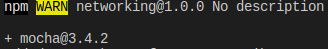
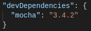
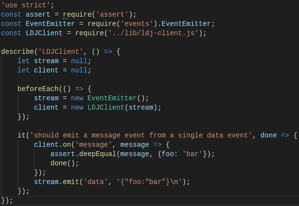
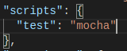
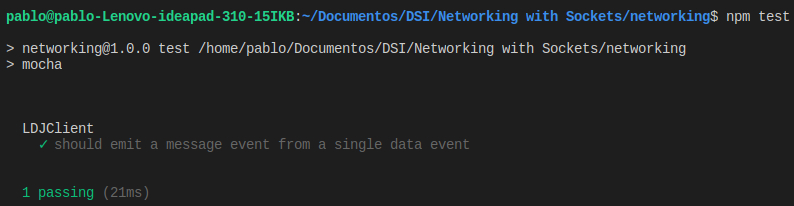

### Developing Unit Tests with Mocha

*Mocha* es un framework multiparadigma para Node.js que cuenta con varios estilos diferentes para describir las pruebas. En este caso se utilizará *BBD* (behavior-driven-development).

**Installing Mocha with npm**

Comenzamos instalando la herramienta con :

<pre><code> ​​npm​​ ​​install​​ ​​--save-dev​​ ​​--save-exact​​ ​​mocha@3.4.2 </code></pre>

Comprobamos que se ha añadido Mocha y sus dependencias al proyecto:

**Writing Mocha Unit Test**

Creamos nuestra primera prueba unitaria, para ello creamos un directorio llamado *test* para guardar el código relacionado con las pruebas y añadimos un fichero *ldj-client-test* con el siguiente código:

En primer lugar obtenemos los modulos que van a utilizarse, como *assert*, que contiene funciones para comparar valores.

Luego se usa el método *describe* de Mocha para crear un contexto con nombre para las pruebas que involucren a *LDJClient*, el segundo argumento de *describe* es una función que contiene el contenido de la prueba.

Dentro de la prueba se declaran dos variables: una para la instancia de *LDJClient*, *client*, y otra para el *EvenEmitter* subyacente, *stream*. Antes en *beforeEach* se declaran nuevas instancias a cada uno de estas variables. Finalmente se llama a *it* para comprobar un comportamiento específico de la clase.

En el cuerpo de la prueba configuramos un controlador de eventos de mensajes en el cliente. El controlador utiliza el método *deepEqual* para comprobar que la carga que recibimos coincide con nuestras expectativas.

**Running Mocha Tests From Npm**

Para ejecutar las pruebas de Mocha con *nmp*, tenemos quemodificar el fichero *package.json*:

Ahora solo tendremos que ejecutar en la terminal <code>npm test</code>, si queremos realizar una prueba *Mocha*, podemos añadir la línea <code>process.nextTick(() => stream.emit('data', '"bar"}\n'));</code>. Veamos su ejecución:

